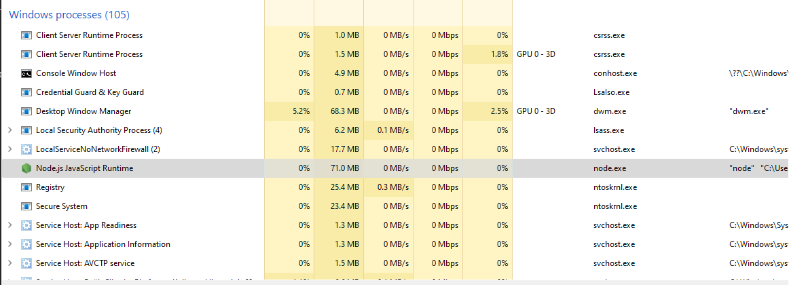
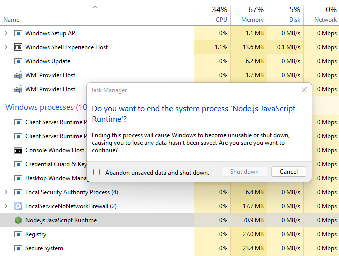

# Unkillable.js
Unkillable windows processes

## Build
`npm run build`

## Test (please run node.js a administrator)
`npm test`

In the example, the process cannot be stopped for 60 seconds and when you try to stop it, it will cause a Windows BSOD screen.

## Screenshots

